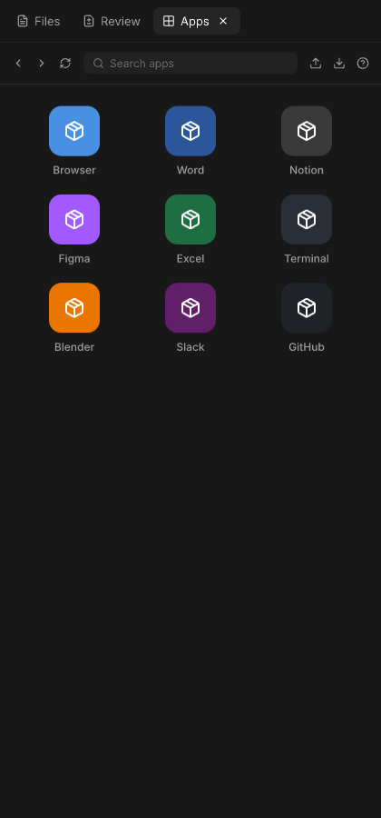
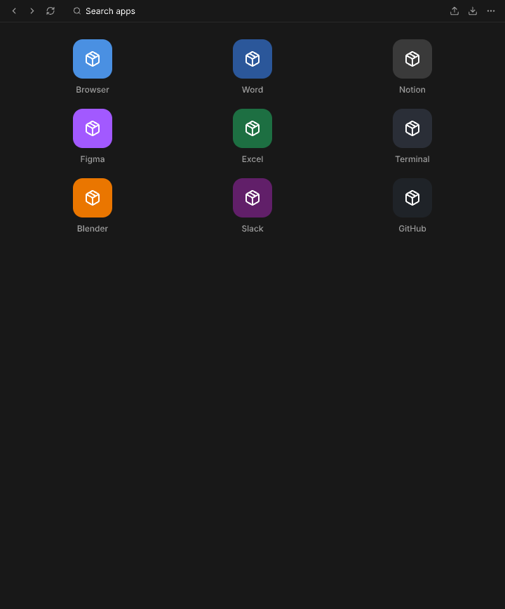
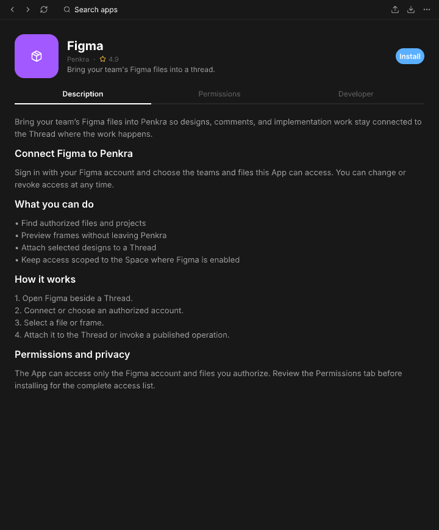
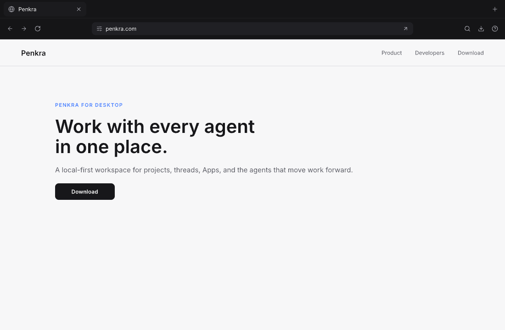
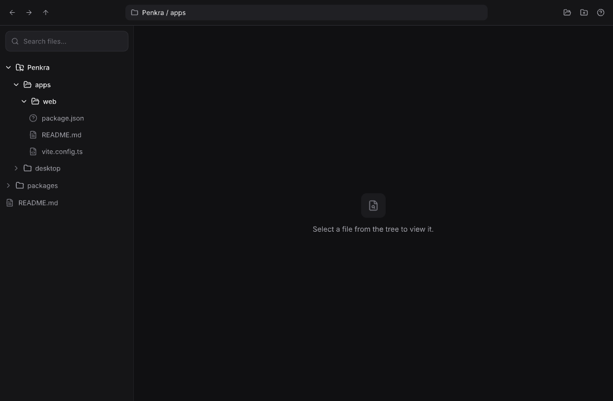
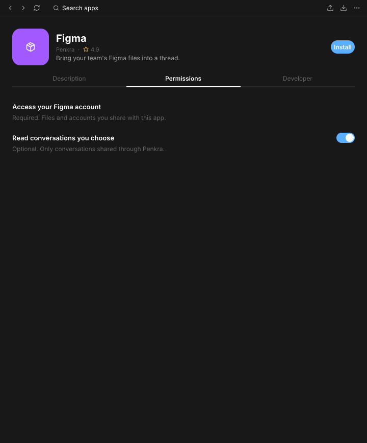

# Penkra Apps

Each App in this repository has an independent manifest version and App Registry release. Penkra
desktop versions, tags, and GitHub Releases do not version or publish these Apps. The
`compatibility.penkra` field in each App manifest expresses compatibility only; it does not couple
the two release tracks.

**First-party Apps built for the Penkra workspace.**

<p align="center">
  
</p>

Penkra Apps are small, self-contained web applications that run inside Penkra's right panel. Each App gets its own isolated tab and can connect to your agent threads to read, write, and act on your behalf — with explicit permissions you control.

This repository contains the five first-party Apps built for Penkra.

## The Apps

### Apps — App Manager

<p align="center">
  
  
</p>

The Apps App is how you discover, install, and manage other Apps in Penkra. It connects to the App registry and gives you a launcher to browse what's available, a search to find specific Apps, and detail views where you can inspect an App's description, permissions, and developer info before installing.

Once installed, Apps appear in your panel tab strip and are ready to use.

### Browser — Web browsing



The Browser App gives you scoped web browsing sessions inside Penkra. You can navigate to any website, follow links, and download files — and agent threads can interact with the browser on your behalf when you allow it.

The Browser uses Penkra's public scoped-browser-session service, so browsing activity stays contained and permissions are explicit.

### Explorer — File browsing



The Explorer App lets you browse, search, preview, and open files on your system. It uses user-mediated web file handles rather than raw filesystem access, so you stay in control of what the App (and any connected agent thread) can see.

You can preview files directly in the panel or open them with the appropriate tool.

### Canvas — Collaborative design editor

Canvas is an Account-scoped collaborative editor for cloud-hosted design documents. It supports
loss-preserving `.pen` import and export, realtime and offline editing, sharing, and typed agent
operations through Penkra's public App runtime. Its approved Pencil design, runtime source,
compatibility corpus, collaboration tests, and package build all live under `canvas/`.

### Simulator — Mobile device simulation

The Simulator App creates and controls saved iPhone, iPad, and Android simulated devices through
Penkra's scoped simulator-session service. Penkra owns native tooling, setup prompts, and process
lifecycle while the App provides the complete device-management and interactive control surface.

## How Apps work

Every App is an independent web application with its own source, manifest, tests, and design file. Apps run in isolation — each one gets its own tab in Penkra's right panel and communicates with the host through a public SDK.

Key concepts:

- **Manifests** (`penkra-app.json`) declare what the App needs — its ID, name, permissions, and entry points
- **Scoped services** give Apps explicit access to hosted capabilities such as account data,
  browser sessions, and simulators without broad system access
- **Native file pickers** use the browser-standard File System Access API; the user's selection is
  the authorization boundary, with no separate Penkra filesystem vocabulary
- **Permissions** are explicit and user-controlled — Apps cannot access host capabilities they
  haven't been granted
- **Isolation** means one App cannot see or interfere with another App's state

Penkra owns the trusted panel tab strip. Each App owns its complete web surface and may render the standard App Bar on any page using the public specification.



## For developers

### Tech stack

Apps are built with vanilla JavaScript — no framework dependency. This keeps them lightweight and ensures they work with the public runtime available to any third-party developer.

| Component | Technology |
|-----------|-----------|
| UI | Vanilla HTML/CSS/JS |
| Design | Pencil (`.pen` files) |
| Testing | Node.js native test runner |
| Manifests | `penkra-app.json` |

### Repository structure

```text
penkra-apps/
├── apps/
│   ├── app.html            # App entry point
│   ├── app.js              # App logic
│   ├── styles.css          # App styles
│   ├── operations.html     # Operations entry point
│   ├── operations.js       # Operations logic
│   ├── penkra-app.json     # App manifest
│   ├── INSTRUCTIONS.md     # Agent instructions
│   ├── ui-model.mjs        # Pure logic (framework-free)
│   └── design/apps.pen     # Pencil design source
├── browser/
│   ├── app.html, app.js, styles.css
│   ├── operations.html, operations.js
│   ├── penkra-app.json
│   ├── browser-model.mjs
│   └── design/browser.pen
├── canvas/
│   ├── app.html, app.js, styles.css
│   ├── operations.html, operations.js
│   ├── penkra-app.json
│   ├── src/                 # Runtime, API, document, and operation models
│   ├── compatibility/       # Loss-preservation corpus and differential checks
│   ├── collaboration/       # Yjs convergence and recovery tests
│   ├── RESEARCH.md           # Standards and upstream audit
│   └── design/canvas.pen     # Approved UI/UX authority
├── explorer/
│   ├── app.html, app.js, styles.css
│   ├── operations.html, operations.js
│   ├── penkra-app.json
│   ├── explorer-model.mjs
│   └── design/explorer.pen
└── simulator/
    ├── app.html, app.js, styles.css
    ├── penkra-app.json
    ├── simulator-model.mjs
    └── design/simulator.pen
```

### Design system

Each App has an authoritative Pencil file in its `design/` directory. Pencil is the source of truth for that App's UI, states, language, and visual composition. Do not build UI that isn't in the corresponding Pencil design.

### Building your own App

Third-party developers can build Apps using the public Penkra SDK. Every App runs in the same isolated environment as the first-party Apps — there are no hidden privileges.

- App SDK and development guide: see the main [Penkra repository](../penkra)
- App IDs use the reverse `penkra.com` namespace: `com.penkra.*`
- Each App keeps its design, implementation, assets, and tests in its own folder
